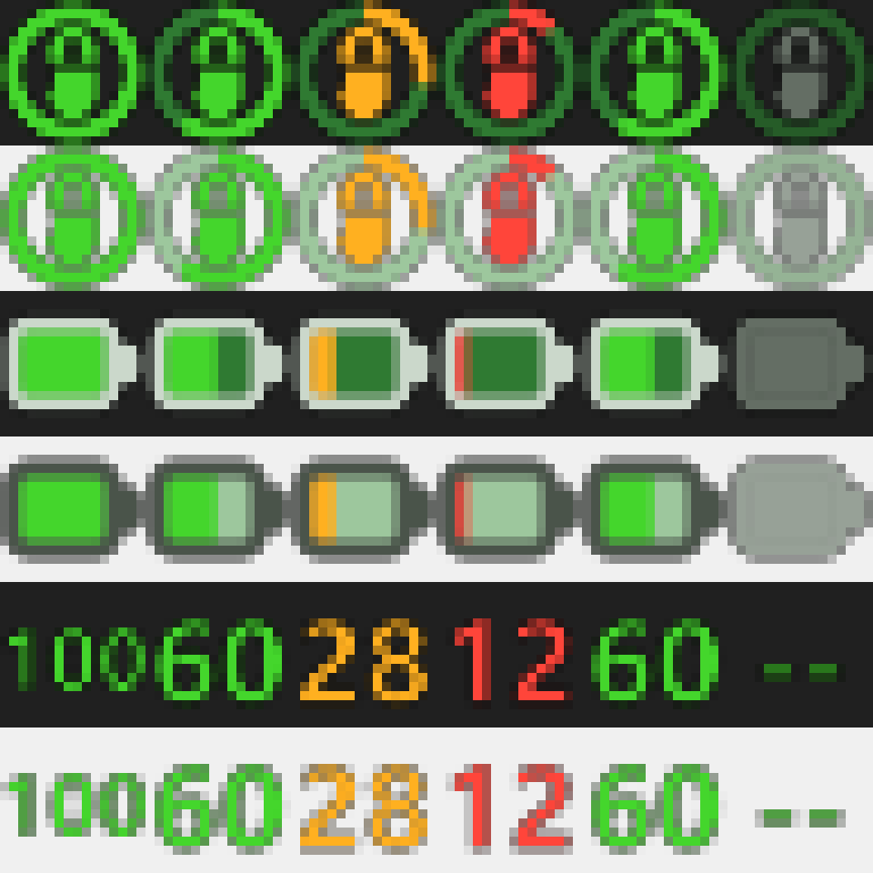
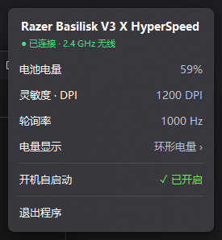

# razer-tray

<div align="center">
  
  <h1>razer-tray</h1>
  <p>常驻 Windows 托盘的雷蛇鼠标状态工具</p>
  <p><b>连接状态 · 电量 · DPI · 轮询率</b></p>
</div>

---

## 简介

`razer-tray` 是一个无窗口的托盘小工具：自动识别雷蛇（Razer）鼠标，读取并显示连接状态、
电量、DPI 与轮询率，并在托盘图标上直接显示电量。

它**只读取设备状态**，不下发 DPI、灯光、按键映射等设置命令，也不写入板载配置。

本项目由雷柏版本 [rapoo-tray](https://github.com/Iris-0109/rapoo-tray) 改造而来，设备层、
遥测协议与图标渲染均为雷蛇专用实现，详见「灵感来源与致谢」。

## 下载

- **直接用**：到 [Releases](https://github.com/XiaoKang0212/razer-tray/releases) 下载
  `razer-tray.exe` 双击运行即可。免安装、绿色版、静态链接，不需要额外运行库，也不用管理员权限。
- **自己编译**：源码仓库不包含编译产物，`bin/` 目录由构建脚本生成，见「构建」一节。

## 功能

- **自动识别**：扫描 Razer USB VID `1532` 的 HID 控制接口（`0xFF00` 厂商接口，或承载 90/91 字节
  Feature 报文的鼠标接口），无需选择设备。
- **三种电量显示**：右键菜单「电量显示」可在 **环形电量 / 电池图标 / 数字显示** 之间切换，
  选择结果写入注册表，重启后保持。
- **主题显示**：右键菜单可选 **浅色 / 深色 / 跟随系统**，选择会保存并同时应用到菜单、OSD 和托盘图标。
- **环形样式**：中心为项目自制的简约鼠标标志 + 外围电量环。整圈为绿色底环，较亮的弧段表示已用电量
  （<30% 转橙色、<15% 转红色），中心保持透明、不填充底色；未连接时整体变暗。
- **连接检测**：区分「接收器已插入」与「鼠标已开机」。鼠标电源关闭时显示
  「接收器已就绪 · 鼠标未连接」，唤醒后自动恢复。
- **点击即刷新**：单击（或双击）托盘图标会立即重新读取电量、DPI、轮询率并弹出 OSD；
  右键打开菜单前同样先刷新一次。
- **OSD 纯显示层**：点击会穿透到下方窗口，不会打断正在进行的拖拽或点击；外观与右键菜单一致，
  浅色与深色模式均使用亚克力背景；文字和控件通过独立的 Alpha 通道绘制，确保浅色背景下清晰可见，
  并保留抗锯齿圆角与边框。
- **右键菜单**：显示型号与连接方式，以及电池电量 / 灵敏度 · DPI / 轮询率 / 电量显示 /
  主题显示 / 开机自启动 / 退出程序。
- **诊断日志**：每次刷新写一行精简记录到 `%LOCALAPPDATA%\RazerTray\telemetry.log`，
  读取失败时便于排查（菜单中不提供入口）。

## 截图

三种电量显示方式（16 px 实际尺寸；每组上排深色任务栏、下排浅色，列依次为
100% / 60% / 28% / 12% / 充电 / 未连接）：



OSD 状态提示：


右键菜单与「电量显示」子菜单：



## 使用

1. 运行 `bin\razer-tray.exe`，程序无主窗口，直接驻留通知区域。
2. **单击 / 双击**托盘图标：立即刷新并显示状态 OSD。
3. **右键**托盘图标：打开菜单（打开前会自动刷新一次）。
4. 菜单中的「开机自启动」写入 `HKCU\Software\Microsoft\Windows\CurrentVersion\Run`。

状态每 10 秒自动刷新一次；设备插拔由系统设备通知即时触发。

程序是单文件绿色版（静态链接、无运行库依赖），可以放到任意目录使用，例如 `D:\apps\razer-tray.exe`；
移动位置后如需开机自启动，请重新开关一次「开机自启动」菜单项，让它记录新的路径。

## 电量显示方式

| 样式 | 说明 | 注册表值 |
| --- | --- | --- |
| 环形电量（默认） | 圆环按电量填充，中心为项目鼠标标志 | `BatteryStyle = 0` |
| 电池图标 | 经典横向电池，按电量填充 | `BatteryStyle = 1` |
| 数字显示 | 直接显示电量百分比数字 | `BatteryStyle = 2` |

设置保存在 `HKCU\Software\razer-tray`，随程序启动读取。

## 设备支持

识别方式为 **USB Vendor ID `1532` + 控制接口探测**：程序遍历 Razer HID 接口，
选择承载 90/91 字节 Feature 报文的接口（不同机型可能是 `0xFF00` 厂商接口，
也可能是 Windows 只允许「仅写」打开的鼠标接口）；DeathAdder V3 Pro 的已知控制接口即使未在
HID 描述符中声明 Feature 报文，也会按其鼠标集合进行探测。DeathAdder V3 Pro 有线连接已实机确认；
无线版目前没有设备可供实机验证和进一步适配，暂不保证可用。

### Basilisk

| 型号 | PID | 连接 | 验证状态 |
| --- | --- | --- | --- |
| Razer Basilisk | 0x0064 | 有线 | 待验证 |
| Razer Basilisk Essential | 0x0065 | 有线 | 待验证 |
| Razer Basilisk X HyperSpeed | 0x0083 | 无线 | 待验证 |
| Razer Basilisk V2 | 0x0085 | 有线 | 待验证 |
| Razer Basilisk Ultimate (Wired) | 0x0086 | 有线 | 待验证 |
| Razer Basilisk Ultimate (Receiver) | 0x0088 | 无线 | 待验证 |
| Razer Basilisk V3 | 0x0099 | 有线 | 待验证 |
| Razer Basilisk V3 Pro (Wired) | 0x00AA | 有线 | 待验证 |
| Razer Basilisk V3 Pro (Wireless) | 0x00AB | 无线 | 待验证 |
| Razer Basilisk V3 X HyperSpeed | 0x00B9 | 无线 | ✅ 实机验证 |
| Razer Basilisk V3 35K | 0x00CB | 有线 | 待验证 |
| Razer Basilisk V3 Pro 35K (Wired) | 0x00CC | 有线 | 待验证 |
| Razer Basilisk V3 Pro 35K (Wireless) | 0x00CD | 无线 | 待验证 |

### Viper

| 型号 | PID | 连接 | 验证状态 |
| --- | --- | --- | --- |
| Razer Viper | 0x0078 | 有线 | 待验证 |
| Razer Viper Ultimate (Wired) | 0x007A | 有线 | 待验证 |
| Razer Viper Ultimate (Wireless) | 0x007B | 无线 | 待验证 |
| Razer Viper Mini | 0x008A | 有线 | 待验证 |
| Razer Viper 8KHz | 0x0091 | 有线 | 待验证 |
| Razer Viper V2 Pro (Wired) | 0x00A5 | 有线 | 待验证 |
| Razer Viper V2 Pro (Wireless) | 0x00A6 | 无线 | 待验证 |
| Razer Viper V3 HyperSpeed | 0x00B8 | 无线 | 待验证 |
| Razer Viper V3 Pro (Wired) | 0x00C0 | 有线 | 待验证 |
| Razer Viper V3 Pro (Wireless) | 0x00C1 | 无线 | 待验证 |

### DeathAdder

| 型号 | PID | 连接 | 验证状态 |
| --- | --- | --- | --- |
| Razer DeathAdder 3500 | 0x0054 | 有线 | 待验证 |
| Razer DeathAdder Elite | 0x005C | 有线 | 待验证 |
| Razer DeathAdder Essential | 0x006E | 有线 | 待验证 |
| Razer DeathAdder V2 | 0x0084 | 有线 | 待验证 |
| Razer DeathAdder V2 Mini | 0x008C | 有线 | 待验证 |
| Razer DeathAdder V2 X HyperSpeed | 0x009C | 无线 | 待验证 |
| Razer DeathAdder V3 | 0x00B2 | 有线 | 待验证 |
| Razer DeathAdder V3 Pro (Wired) | 0x00B6 | 有线 | ✅ 实机确认 |
| Razer DeathAdder V3 Pro (Wireless) | 0x00B7 | 无线 | 暂未验证（暂无设备可测试/适配） |
| Razer DeathAdder V4 Pro (Wired) | 0x00BE | 有线 | 待验证 |
| Razer DeathAdder V4 Pro (Wireless) | 0x00BF | 无线 | 待验证 |
| Razer DeathAdder V3 Pro (Wired, ALT) | 0x00C2 | 有线 | 待验证 |
| Razer DeathAdder V3 Pro (Wireless, ALT) | 0x00C3 | 无线 | 暂未验证（暂无设备可测试/适配） |
| Razer DeathAdder V3 HyperSpeed (Wired) | 0x00C4 | 有线 | 待验证 |
| Razer DeathAdder V3 HyperSpeed (Wireless) | 0x00C5 | 无线 | 待验证 |

### 其他型号与能力说明

- 不在上表中的雷蛇鼠标：只要系统产品名包含鼠标相关关键字（如 `DeathAdder`、`Viper`、
  `Basilisk`、`Mouse` 等），程序仍会识别并使用系统提供的产品名显示，遥测可用性取决于固件。
- **电量**：命令 `0x07/0x80`，原始值 0–255 换算为百分比；接收器或鼠标未响应时不显示。
- **充电状态**：命令 `0x07/0x84`。使用 AA/AAA 电池的机型（例如 Basilisk V3 X HyperSpeed）
  固件不上报充电状态，属正常现象。
- **DPI**：命令 `0x04/0x85`（7 字节参数），优先读取硬件当前值，失败时回退到软件档位值。
- **轮询率**：命令 `0x00/0x85`；8000 Hz 级设备回退到 `0x00/0xC0`。
- **验证状态**：上表「验证状态」列标出在真机上实际测试过的机型。Razer Basilisk V3 X HyperSpeed
  （`0x00B9`）的电量、DPI、轮询率均读取正常（测试时为 60% / 1200 DPI / 1000 Hz）；
  DeathAdder V3 Pro 有线连接已确认。DeathAdder V3 Pro 无线版因目前没有设备，尚未实机验证或完成进一步适配；
  其余标记为「待验证」的型号依照公开协议适配，欢迎反馈实际测试结果。

## 已知限制

- 托盘图标尺寸由系统决定：100% 缩放下为 16×16 像素，图形已按该尺寸优化，但不可能再提高物理分辨率。
- 无线鼠标休眠时所有查询会超时，界面显示 `--`（接收器仍在线），唤醒后 10 秒内自动恢复。
- 蓝牙连接、未暴露 90/91 字节 Feature 报文的机型，或固件不支持的查询项无法读取。
- 本工具只读：不能修改 DPI、轮询率、灯光或按键，也不提供驱动级功能。

## 构建

需要 MinGW-w64（`g++` + `windres`）或 MSVC（`cl` + `rc`）任一套工具链：

```bat
build.bat
```

产物为 `bin\razer-tray.exe`（静态链接、无运行库依赖）。

`bin/` 与 `dist/` 都是构建产物目录，已在 `.gitignore` 中忽略，不会提交到仓库。

可选组件：

```bat
installer\build_installer.bat   :: 需要先有 bin\razer-tray.exe，产物 dist\razer-tray-setup.exe
powershell -File tools\make_logo.ps1        :: 用代码重绘标志，输出 res\logo.png / logo_mask.bin / app.ico
```

`tools\make_logo.ps1` 中的标志完全由本项目用基础图形绘制（圆角机身 + 滚轮开孔 + 按键分缝 + 侧键缺口），
不对应任何厂商的标志；想换成自己的图形时，只需替换该脚本或直接替换 `res\logo.png` 与 `res\logo_mask.bin`。

## 目录结构

```
razer-tray/
├─ src/
│  ├─ main.cpp            托盘、窗口消息与刷新调度
│  ├─ device_manager.cpp  Razer HID 枚举、协议查询、连接判定
│  ├─ tray_icon.cpp       托盘图标绘制（环形 / 电池 / 数字）
│  ├─ tray_menu.cpp       右键菜单与设置项
│  └─ osd_window.cpp      OSD 提示窗口
├─ res/
│  ├─ app.ico             程序图标（多尺寸）
│  ├─ logo.png            项目标志（原创简约鼠标，脚本生成）
│  ├─ logo_mask.bin       由同一脚本生成的字形掩膜（托盘图标用）
│  ├─ app.rc / app.manifest
├─ installer/             可选安装包工程
├─ tools/make_logo.ps1    用代码重绘标志与图标
├─ docs/                  截图
├─ build.bat
└─ LICENSE
```

## 免责声明

- 本项目是个人自用的免费开源工具，与任何硬件厂商均无隶属、赞助、授权或背书关系。
- 文中出现的产品名称与商标归各自所有者，在此仅用于说明兼容性。
- 界面标志与图标由本项目自行绘制（源码见 `tools/make_logo.ps1`，为基础图形拼合的简约鼠标造型），
  未使用任何厂商的标志、图标或界面素材；项目名称中的「razer」仅用于说明所兼容的设备品牌。
- 本工具只读取设备状态，不修改设备设置，也不包含任何厂商的官方软件、驱动或固件。
- 软件按「现状」提供，不承诺在所有设备或固件版本上都可用；使用风险由使用者自行承担。

## 灵感来源与致谢

- **灵感与代码基础**：[Iris-0109/rapoo-tray](https://github.com/Iris-0109/rapoo-tray)（MIT）。
  托盘的交互方式、右键菜单、OSD 与安装包工程都源自该项目；本仓库把设备层替换为雷蛇鼠标，
  重写了遥测协议、连接判定、托盘图标绘制与 OSD 渲染。
- **协议与设备清单参考**：[OpenRazer](https://github.com/openrazer/openrazer)（GPL-2.0）。
  本项目仅参考其公开的协议命令与设备 PID 清单，未复制其源代码。

## 许可

[MIT](LICENSE)。沿用原项目版权声明：Copyright (c) 2026 Iris，Copyright (c) 2026 razer-tray contributors。
